# Juego de Serpientes y Escaleras 🎲

**Autor:** Heyer Tinoco
## Clonación y dependencias

Para acceder al proyecto, se debe realizar la clonación del repositorio:

```
git clone https://github.com/OrlandH/Snakes_and_Ladders_H.git
```
> [!NOTE]
>
> Una vez clonado el repositorio se debe asegurar de tener todas las dependencias de python [`colorama`, `random`, `os`] de lo contrario, instálelas mediante consola

```
pip install colorama
```
```
pip install random
```
## Ejecutar el programa
El juego se puede iniciar mediante consola de comandos, ubicándonos en el directorio donde esté el proyecto. Ejecutando el codigo:

```
python main.py
```
O especificando la versión que tengamos, por ejemplo:

```
python3 main.py
```
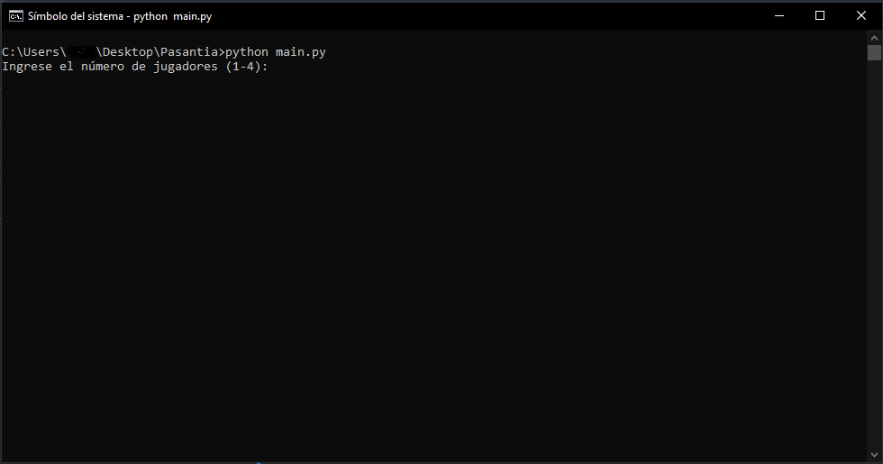

>Imagen 1: Iniciar el programa mediante CMD.

Tambien podemos probar en un IDE de nuestra preferencia como por ejemplo Visual Studio Code. Donde tenemos las opciones de usar el mismo comando en la consola, o iniciar con facilidades del IDE ubicándonos en main.py.

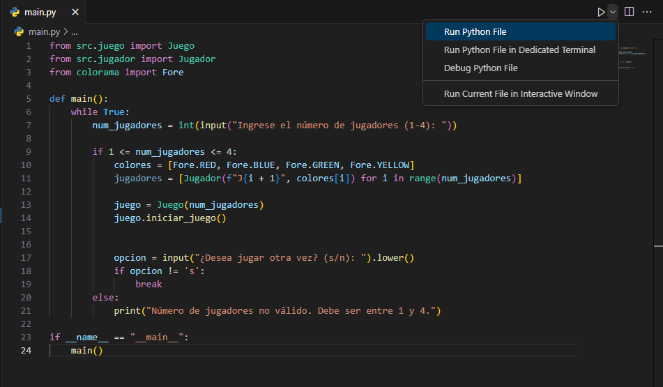

>Imagen 2: Iniciar el programa mediante un IDE.

## Serpientes y Escaleras:
*Serpientes y Escaleras es un juego de mesa en el que participan dos o más jugadores que lanzan dados para mover sus fichas a lo largo de un tablero. El tablero está compuesto por una serie de casillas numeradas y está adornado con 'serpientes' y 'escaleras', que conectan dos casillas en el tablero: las serpientes enlazan las casillas hacia abajo, mientras que las escaleras las enlazan hacia arriba. Esto significa que al caer al pie de una escalera, te mueves hacia la cima de esa escalera, mientras que al caer en la parte superior de una serpiente, te desplazas hacia la parte inferior de esa serpiente. El objetivo del juego es llevar tu ficha a la casilla final antes que tus oponentes*

### Enunciado: 
La primera característica que queremos implementar es la capacidad de mover tu ficha por el tablero usando lanzamientos de dados. Los jugadores necesitarán la habilidad de lanzar un dado, mover su ficha el número de casillas indicado por el lanzamiento del dado y deberían ganar si aterrizan en la casilla final. La característica se divide en tres pruebas unitarias.

### Caracteristicas y funcionamiento:

#### Requisitos y Evaluacion:

- La aplicación debe utilizar la consola para entrada y salida.
- Utilizar un lenguaje orientado a objetos, preferiblemente C o Swift. (proporcionar instrucciones sobre cómo ejecutar la aplicación).
- Implementar los requisitos centrándote en escribir el mejor código posible.
  
  Se evalua:
- Producir código legible y mantenible, utilizando principios de diseño orientado a objetos.
- Las UATs deben respaldarse con pruebas.
  
#### Tablero de juego
En este caso, se usó como referencia el tablero de juego incluido en el PDF para representarlo en consola, ya que no se uso una interfaz gráfica. 

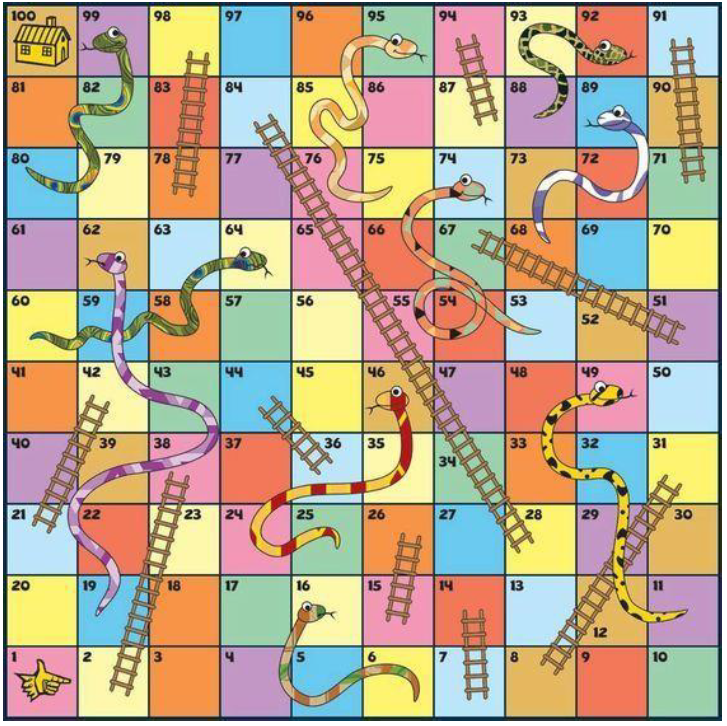

>Imagen 3: Tablero Original.

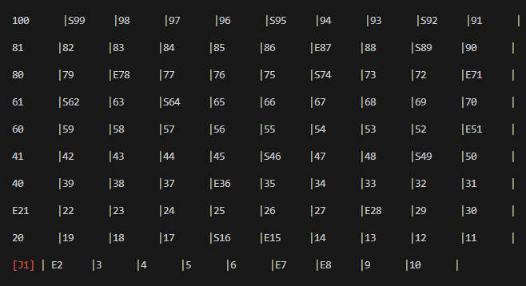

>Imagen 4: Tablero en Consola.

En este caso se respeta el camino en zig zag a partir de los numeros representando la casilla, y las casillas que empiezan con las letras `E` y `S` representan las escaleras y serpientes en las mismas posiciones que en el Tablero original.

#### Jugador
El jugador esta representado mediante texto. Es posible elegir hasta 4 jugadores al inicio del juego, y se representaran con `[J1]`, `[J2]`, `[J3]` y `[J4]` con colores únicos cada uno.

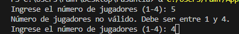

>Imagen 5: Seleccionar número de jugadores validando que el rango sea entre 1 y 4.

Estos jugadores se desplazaran a través de los números del tablero empezando en la casilla 1 moviendose al girar un dado mediante una tecla que dara un número aleatorio entre 1 y 6 y actualizara su nueva posición remplazando el número del tablero.
Ademas en la parte inferior del tablero se vera actualizado y constantemente la posición de cada jugador, y de quien es el turno actual. 

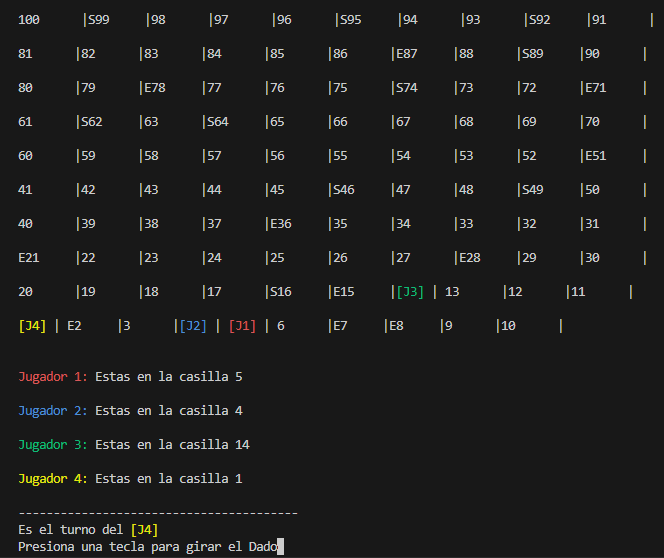

>Imagen 6: Ubicación de cada jugador remplazando el número de casilla en el que esta. Incluso si estan en la misma casilla como [J1] y [J2] en este ejemplo.

#### Funcionalidad Juego
Se escoge el número de jugadores, y ira mediante turnos. En el orden `[J1]`, `[J2]`, `[J3]` y `[J4]`.
Al empezar el juego, todos empezarán en la casilla 1. Se empezara por el turno del `[J1]`, le saldra un mensaje de: *Presione una tecla para girar el dado*
Una vez presionada cualquier tecla, aparecera un número aleatorio entre 1 y 6. Y también saldra un mensaje anunciando a que casilla se moverá antes de moverse terminando con un mensaje de *Presiona una tecla para moverte*

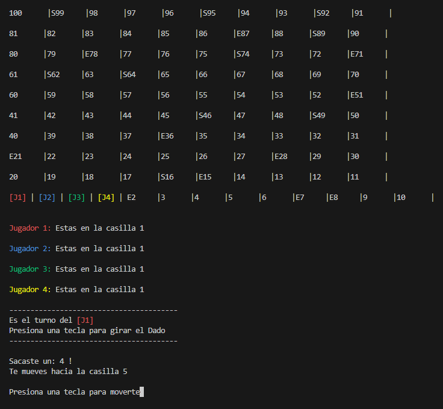

>Imagen 7: Todos comienzan en la casilla 1. Gira el dado y aparece a donde se movera el jugador.

Una vez que tecleamos para movernos, se actualizara la posición del jugador y cambiara de turno actualizando la información para hacer exactamente el mismo proceso con el resto de jugadores en orden.

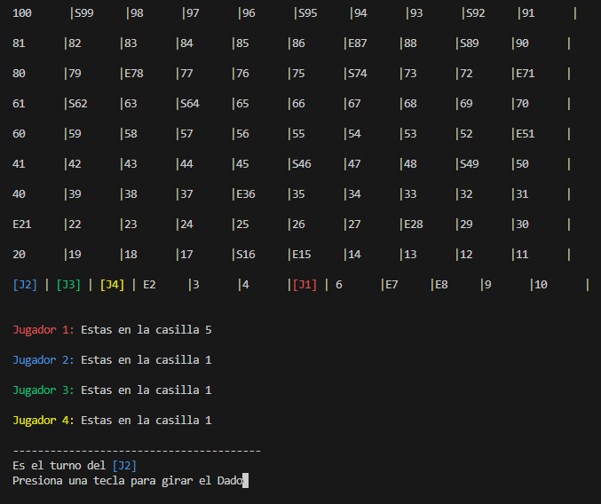

>Imagen 8: El jugador [J1] se movio las casillas que se indico en la Imagen 7.

Luego tenemos los eventos. En este caso, si caemos en una casilla que tenga las letras `E` y `S` cuando se mueva el jugador, saldra un mensaje anunciando si cayo en una escalera o serpiente, y seguido de a que casilla subio, o bajo.
**Escaleras**

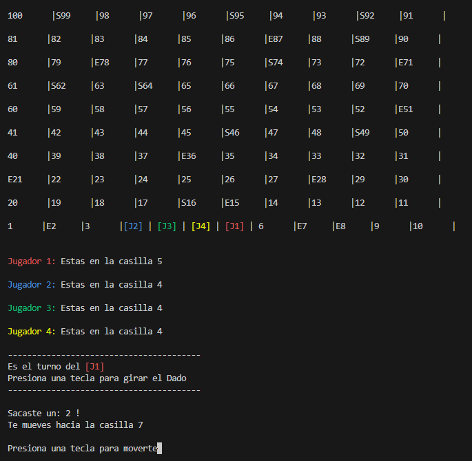

>Imagen 9: Se observa que el [J1] caera en la casilla 7. En el tablero esta representado con E7 asi que es una escalera.

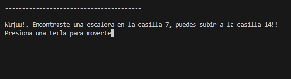

>Imagen 10: Mensaje cuando cae en una escalera, y a donde lo llevara.

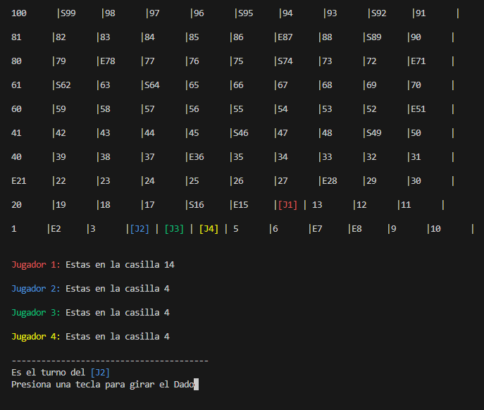

>Imagen 11: Se mueve a la posición mencionada anteriormente.

**Serpientes**

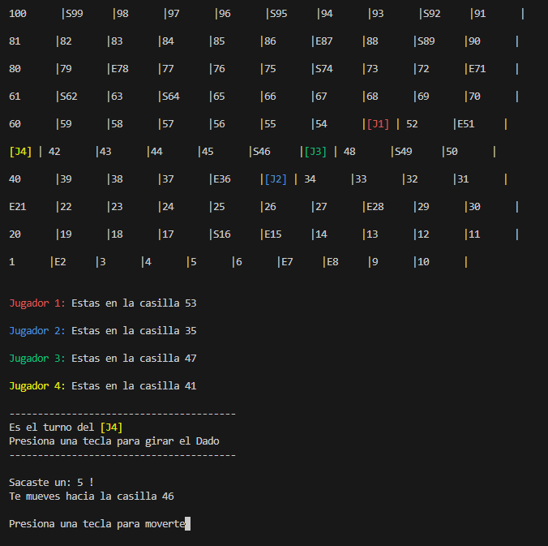

>Imagen 12: Se observa  que [J4] caerá en la casilla 46. En el tablero representado por S46 asi que es una serpiente.

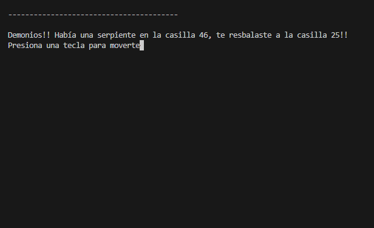

>Imagen 13: Mensaje cuando cae en una serpiente, y a donde lo llevara.

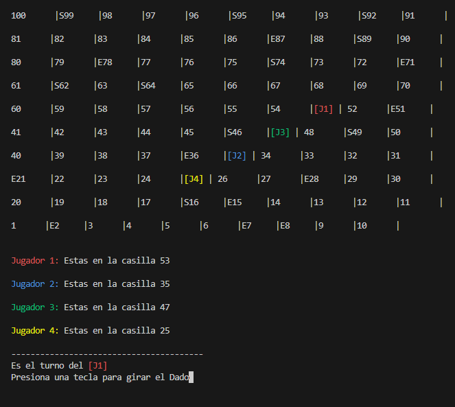

>Imagen 14: Se mueve a la posición mencionada anteriormente.

Finalmente, el jugador que llegue a la casilla 100 ganara, y dara la opcion de repetir el juego.

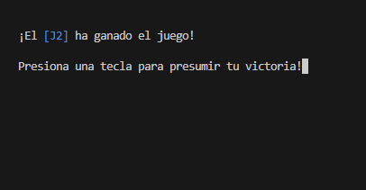

>Imagen 15: Mensaje cuando un jugador gana el juego.

## Respaldo de pruebas US y UATs
### US 1 - La Ficha Puede Moverse por el Tablero
Como jugador quiero poder mover mi ficha para poder acercarme a la meta


>Imagen 7: Todos comienzan en la casilla 1. Se gira el dado para mover la ficha y acercarse a la meta.

#### UAT1: Dado que el juego ha comenzado cuando la ficha se coloca en el tablero, entonces la ficha está en la casilla 1

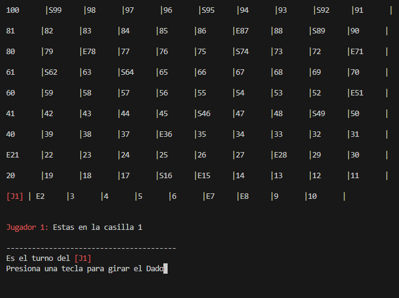

>Imagen 16: La ficha inicia en la casilla 1 .


>Imagen 17: Incluso cuando son varios jugadores, todos inician en la casilla 1.

#### UAT2: Dado que la ficha está en la casilla 1, cuando la ficha se mueve 3 espacios entonces la ficha está en la casilla 4.

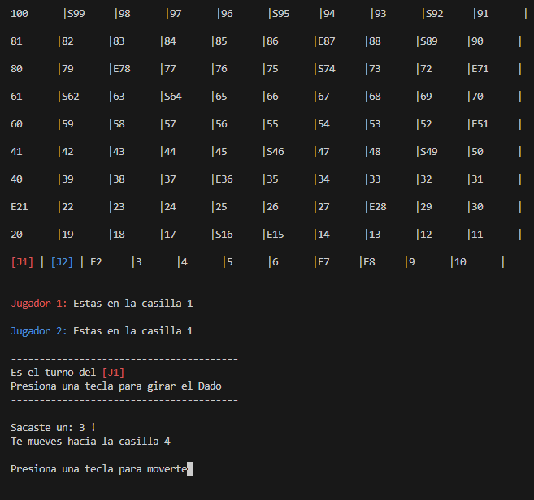

>Imagen 18: Se gira el dado, sale 3, entonces sale en mensaje que se movera a la casilla 4.

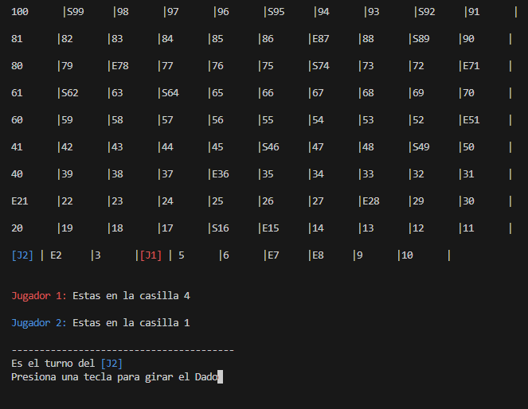

>Imagen 19: Se mueve a la casilla 4 como se menciono.

#### UAT3: Dado que la ficha está en la casilla 1, cuando la ficha se mueve 3 espacios y luego se mueve 4 espacios entonces la ficha está en la casilla 8

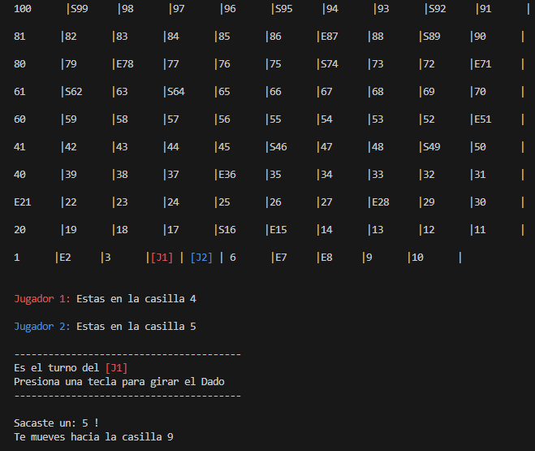

>Imagen 20: La ficha del [J1] sigue en la casilla 4 como se movio anteriormente, giramos el dado de nuevo, sale 5. En este caso se suma y sale el mensaje que se movera a la casilla 9. (En este caso, casilla 9 en lugar de casilla 8, como se menciona en el UAT, pues el dado da números al azar y dio 5 en lugar de 4).

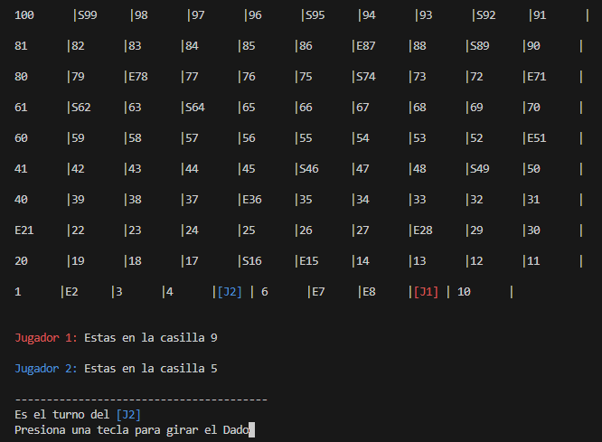

>Imagen 21: Se mueve a la casilla 9 como se menciono.

### US 2 - El Jugador Puede Ganar el Juego
Como jugador quiero poder ganar el juego para poder presumir ante todos

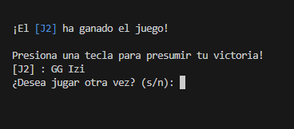

>Imagen 22: El jugador que gana puede lanzar un mensaje para presumir su victoria.

#### UAT1: Dado que la ficha está en la casilla 97 cuando la ficha se mueve 3 espacios entonces la ficha está en la casilla 100 y el jugador ha ganado el juego

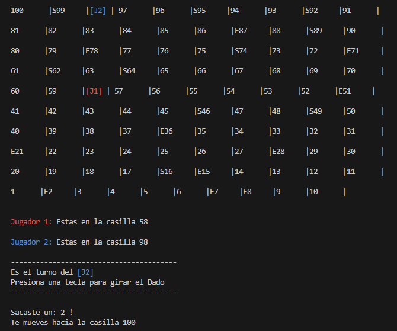

>Imagen 23: La ficha del [J2] se encuentra en la casilla 98, gira el dado y le sale 2. Entonces se movera a la casilla 100.

*(Nuevamente, no se puede ser preciso con el numero que solicita el UAT ya que el numero del dado es aleatorio, pero el funcionamiento es el mismo)* 

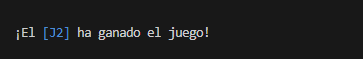

>Imagen 24: Como llego a la casilla 100 cuando se movio, el jugador 2 gana el juego.

#### UAT2: Dado que la ficha está en la casilla 97, cuando la ficha se mueve 4 espacios entonces la ficha está en la casilla 97 y el jugador no ha ganado el juego.

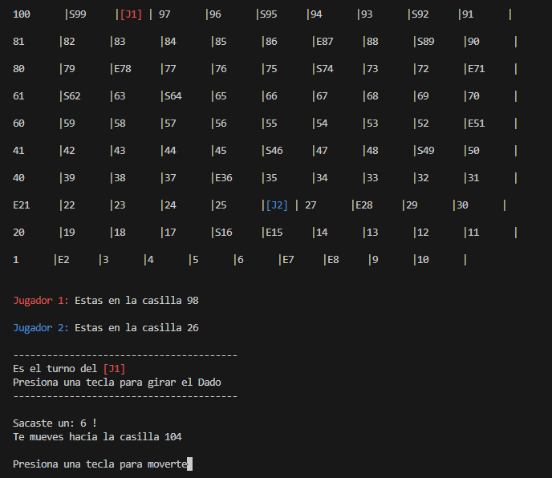

>Imagen 25: La ficha del [J1] se encuentra en la casilla 98, gira el dado y le sale 6. Entonces aparece un mensaje que se movera a una casilla superior a la 100.


>Imagen 26: Cuando se intenta mover, sale un mensaje de que no es posible el movimiento, ya que debe caer preciso en 100.

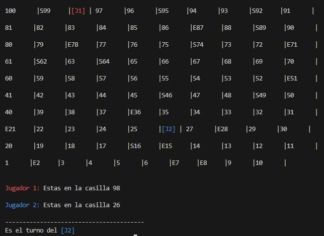

>Imagen 27: A continuación se termina su turno, y el [J1] se mantiene en la casilla 98 ya que no se movio. Y cambia al turno del siguiente jugador.

### US 3 - Los movimientos son Determinados por los Lanzamientos de Dados
Como jugador quiero mover mi ficha basándome en el lanzamiento de un dado para que haya un elemento de azar en el juego

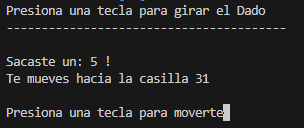

>Imagen 28: Los movimientos son determinados por los lanzamientos de dados.

#### UAT1: Dado que el juego ha comenzado cuando el jugador lanza un dado entonces el resultado debe estar entre 1-6 inclusive


>Imagen 7: El resultado del dado da entre 1 y 6

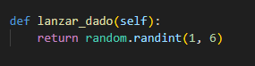

>Imagen 29: Fragmento del código que asegura los valores entre 1 y 6 sean aleatorios.

#### UAT2: Dado que el jugador lanza un 4 cuando mueven su ficha entonces la ficha debería moverse 4 espacios.


>Imagen 8: El jugador [J1] se movio las casillas que se indico en la Imagen 7.


# Gracias!
